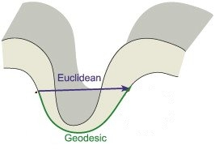
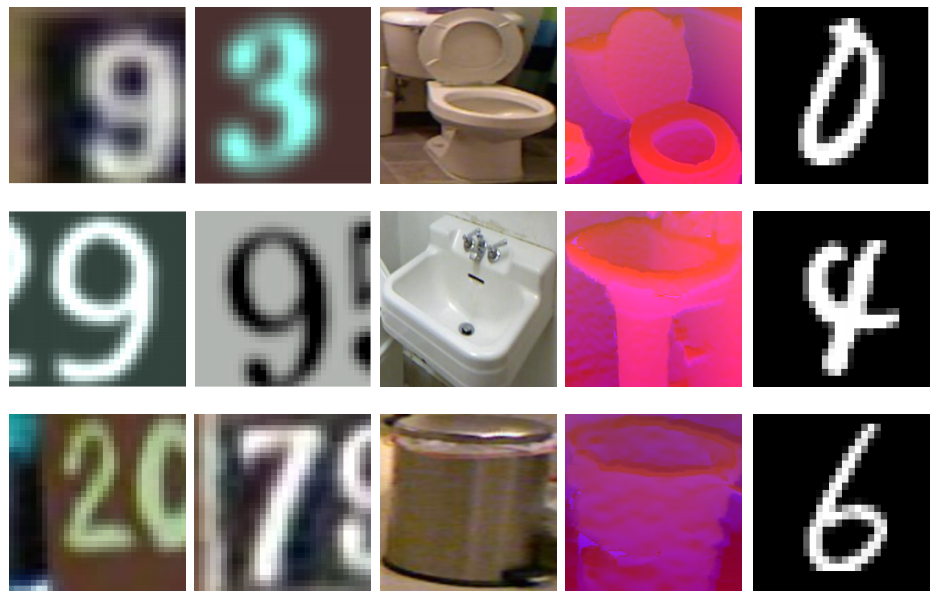

# Minimal-Entropy Correlation Alignment for Unsupervised Deep Domain Adaptation

In this work, we face the problem of unsupervised domain adaptation by leveraging our finding that entropy minimization is induced by the optimal alignment of second order statistics between source and target domains. Aiming at achieving an optimal alignment in practical cases, we adopt a more principled strategy which, differently from current Euclidean approaches, deploys correlation alignment along geodesics. Our pipeline can be implemented by adding to the standard classification loss (on the labeled source domain), a source-to-target regularizer that is weighted in an unsupervised fashion.

## Reference
If you use this code as part of any published research, please acknowledge the following paper:

**"Minimal-Entropy Correlation Alignment for Unsupervised Deep Domain Adaptation"**  
Pietro Morerio, Jacopo Cavazza and Vittorio Murino  
*International Conference on Learning Representations (ICLR), 2018*  
[PDF](https://openreview.net/forum?id=rJWechg0Z)

      @article{
      morerio2018minimalentropy,
      title={Minimal-Entropy Correlation Alignment for Unsupervised Deep Domain Adaptation},
      author={Morerio, Pietro and Cavazza, Jacopo and Murino, Vittorio},
      journal={International Conference on Learning Representations},
      year={2018},
      url={https://openreview.net/forum?id=rJWechg0Z},
      }

## Code
Each sub-folder (*...in progress...*) is named after the adaptation problem analyzed and equipped with its own README. The provided code runs with Python 2.7 (should run with Python 3 as well, not tested). For the installation of ``tensorflow-gpu`` please refer to the [website](http://www.tensorflow.org/install/).

The following command should install the main dependencies on most Linux (Ubuntu) machines

``
sudo apt-get install python-dev python-pip &&
sudo pip install -r requirements.txt
``
      
### Image samples 
Left to rigth: SVHN, SYN, NYUD RGB, NYUD DEPTH (HHA), MNIST.

## License
This repository is released under the MIT LICENSE.
